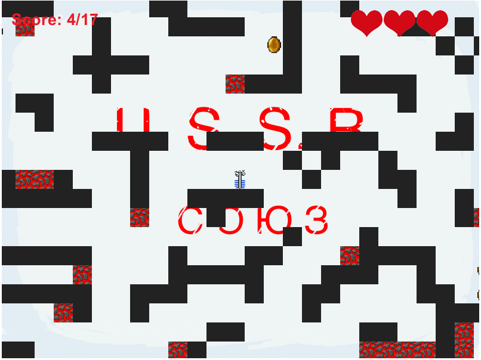

## Introducing

This game was written on Global Games Jam Minsk 2014. Where you have only 48 hours for creating new game. 

It's my first time on hackaton and I had solo code. I used game library [Phaser.js](https://github.com/photonstorm/phaser) new for me. Don't try it on your hackfests!

I decided to write game-parody on movie 'Gravity'. But in my game main hero is Yorshik (eng. `brush`) Clooney. Who should save Bullochka (eng. `bun`) Bullock. 

It's simple 2D platformer where you can change gravity (UP/DOWN). Player must collect all coins on stage for complete level.

You can play [here](http://ar0ne.github.io/ggjm2015_gravity/Gravity/).

### Screenshot

### How to play locally?

If you want to play on your PC you can't just run `index.html` on browser. First you need local web server for it, like Apache. I using python http server. Go to the project folder and run:

`$ python -m SimpleHTTPServer`

And then open your browser at URL:`http://0.0.0.0:8000/Gravity/`.

Or if you want to use Apache, you must to move project folder to your /public_html.

**Warning**: I think this is my WTFest code ever! I used absolutly new library for me and done it solo. Don't show it anybody...Seriously! Don't do it! ツ

